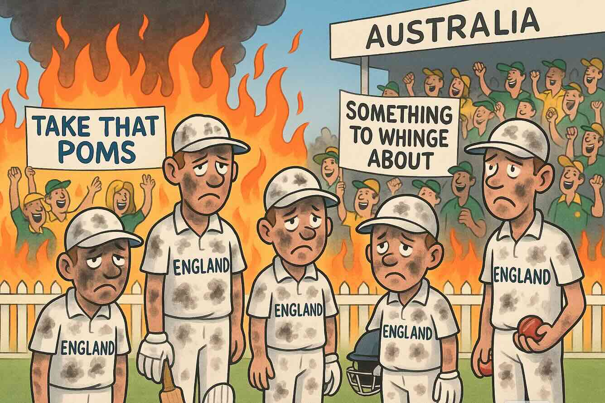
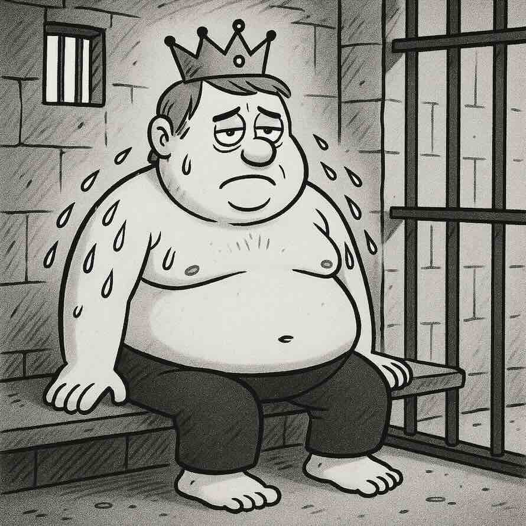
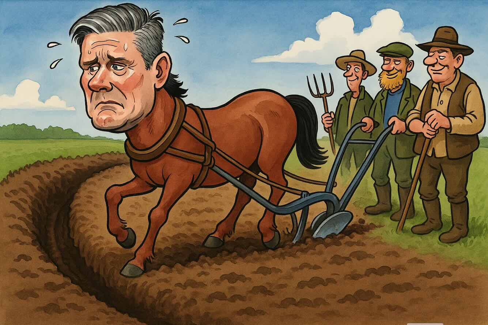
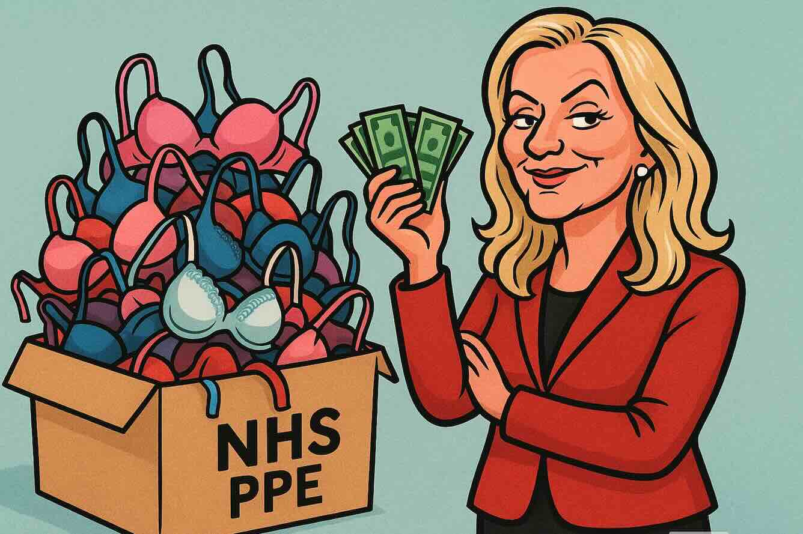
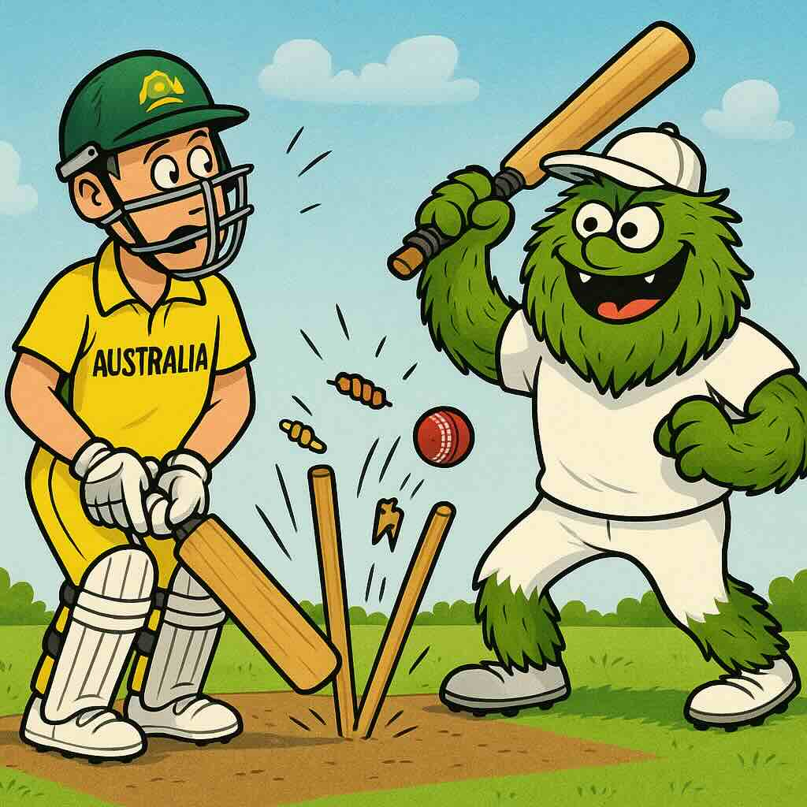
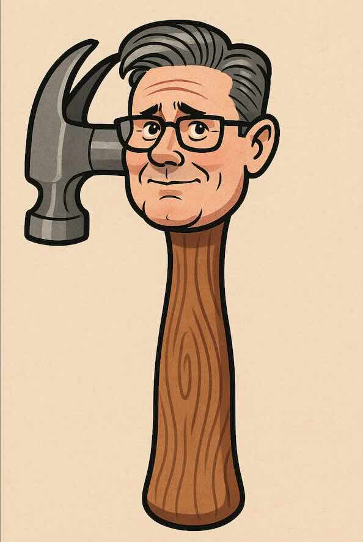
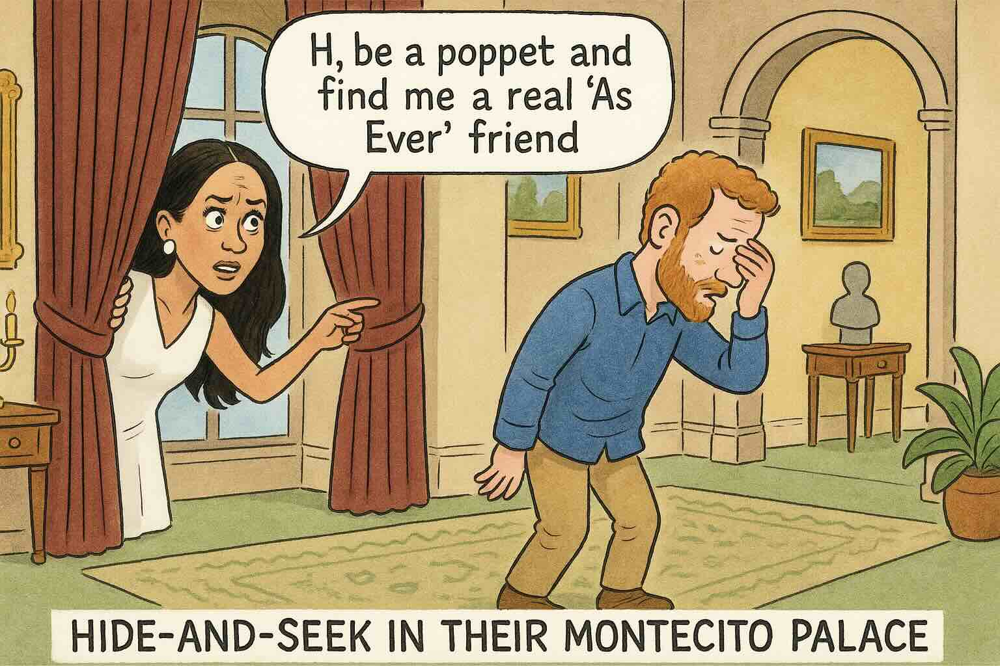
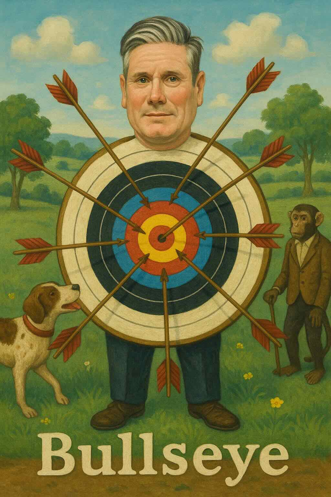

## Christmas Eve 2025

More than bails got burnt this Ashes...

## Christmas Day 2025

Winter pressures...

Santa set to experience multiple delays throughout the NHS ruining Christmas for all children downstream of the UK.  Wes will have to answer for it.

## Boxing day 2025

Fair fights...

Where next for prankster Jake Paul?  A high 8 figure mathematics bout? Surely the joke is on the rest of us.

## December 27 2025

Christmas future for an ex-prince...

Maybe 2026 will be the year for Andrew to rediscover the joy of sweating.

## December 28 2025

Leaders keep on track...

We all respect a leader who can stay on a straight course despite the buffeting of events.  Keir ain't one of those beasts...

## December 29 2025

Motability

Of course people without a car for any reason are ENTITLED to a good new car every 3 years at taxpayers' expense on entering a suitable fiction on the application.

## December 30 2025

About 5 years ago...

NHS rejected the to become baroness' PPE as unsuitable for COVID protection.  Any sign of the money back in the public purse yet?

## December 31 2025

Hollow ashes victory for England - Australia beaten by the furry green monster created by their groundsman.

## January 1st 2026

Happy New Year

## January 2nd 2026

A tool for every job

Even the top job.  I blame Dad the toolmaker

## January 3rd 2026

Marry in haste, repent at your leisure

Every day spent in the company of friends and family is blessed, As Ever

## January 4th 2026

Soft target

Not just a hapless target for satire, but making it a 'top priority' to invite Alaa Abd el-Fattah to our green and pleasant land to target its inhabitant 'dogs and monkeys' is a spectacularly incompetent own-goal.
